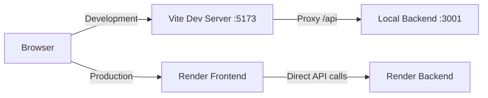

# Deployment Guide - Local & Production

## How API Configuration Works

This application is configured to work seamlessly in both **local development** and **production (Render)** environments.

### Architecture Overview



## Local Development Setup

### 1. Backend Server
```bash
cd server
npm run server
# Runs on http://localhost:3001
```

### 2. Frontend Server
```bash
cd client
npm run dev
# Runs on http://localhost:5173
```

### How It Works Locally

1. **Frontend calls**: `/api/admin/users/123/properties`
2. **Vite proxy** intercepts and forwards to: `http://localhost:3001/api/admin/users/123/properties`
3. **Backend responds** with data

**Configuration Files:**
- [`client/vite.config.js`](file:///Users/ash/Desktop/projects..../real_estate_ai/real_estate_Ai/client/vite.config.js) - Proxy setup
- [`client/src/config/api.js`](file:///Users/ash/Desktop/projects..../real_estate_ai/real_estate_Ai/client/src/config/api.js) - API base URL detection

## Production Deployment (Render)

### How It Works in Production

1. **Frontend calls**: `/api/admin/users/123/properties`
2. **api.js detects** hostname is NOT localhost
3. **Switches to**: `https://realty-ai-price-persona-predictor.onrender.com/api/admin/users/123/properties`
4. **Backend on Render** responds with data

### Build Process

```bash
cd client
npm run build
# Creates optimized production build in dist/
```

### Render Configuration

#### Backend Service (Already Deployed)
- **URL**: `https://realty-ai-price-persona-predictor.onrender.com`
- **Build Command**: `npm install`
- **Start Command**: `npm start` or `node server.js`
- **Environment Variables**: Set your MongoDB connection string, JWT secret, etc.

#### Frontend Service
- **Build Command**: `npm install && npm run build`
- **Publish Directory**: `dist`
- **Static Site**: Yes

> **Note**: The Vite proxy ONLY works during development (`npm run dev`). In production, the built static files use the logic in `api.js` to call the full production URL directly.

## Environment Variables

### Local Development (.env files)

**Server (.env in /server):**
```env
Port=3001
MONGODB_URI=your_mongodb_connection_string
JWT_SECRET=your_jwt_secret
Frontend_URL=http://localhost:5173
```

**Client (optional .env in /client):**
```env
VITE_API_URL=http://localhost:3001
```

### Production (Render Environment Variables)

Set these in your Render dashboard:

**Backend Service:**
- `MONGODB_URI` - Your MongoDB connection string
- `JWT_SECRET` - Your JWT secret key
- `Frontend_URL` - Your frontend URL (e.g., `https://your-app.onrender.com`)
- `Port` - Usually auto-set by Render

**Frontend Service:**
- No environment variables needed (API URL is hardcoded in `api.js`)

## Testing Both Environments

### Test Local Development
1. Start both servers (backend on 3001, frontend on 5173)
2. Navigate to `http://localhost:5173`
3. Login as admin
4. Click "View Properties" - should work ✅

### Test Production
1. Deploy both services to Render
2. Navigate to your production URL
3. Login as admin
4. Click "View Properties" - should work ✅

## Troubleshooting

### Issue: "Failed to load properties" in local development
**Solution**: 
- Ensure backend is running on port 3001
- Check `vite.config.js` proxy points to `http://localhost:3001`
- Restart Vite dev server after config changes

### Issue: "Failed to load properties" in production
**Solution**:
- Verify backend URL in `client/src/config/api.js` matches your Render backend URL
- Check CORS settings in `server/server.js` allow your frontend domain
- Verify backend is running and accessible

### Issue: CORS errors
**Solution**:
- Add your production frontend URL to `allowedOrigins` in `server/server.js`
- Ensure `credentials: true` is set in CORS config

## Current Configuration Summary

✅ **Local Development**: Uses Vite proxy to `localhost:3001`
✅ **Production**: Uses direct calls to `https://realty-ai-price-persona-predictor.onrender.com`
✅ **Auto-detection**: Based on hostname (localhost vs production domain)
✅ **No manual switching needed**: Works automatically in both environments
